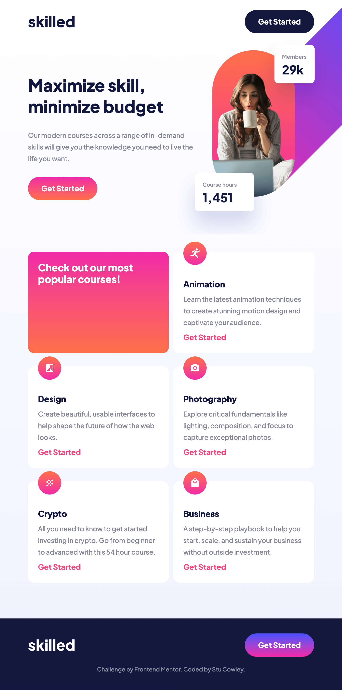

# Frontend Mentor - Skilled e-learning landing page solution

This is a solution to the [Skilled e-learning landing page challenge on Frontend Mentor](https://www.frontendmentor.io/challenges/skilled-elearning-landing-page-S1ObDrZ8q). Frontend Mentor challenges help you improve your coding skills by building realistic projects.

## Table of contents

- [Overview](#overview)
  - [The challenge](#the-challenge)
  - [Screenshot](#screenshot)
  - [Links](#links)
- [My process](#my-process)
  - [Built with](#built-with)
  - [What I learned](#what-i-learned)
- [Author](#author)

**Note: Delete this note and update the table of contents based on what sections you keep.**

## Overview

### The challenge

Users should be able to:

- View the optimal layout depending on their device's screen size
- See hover states for interactive elements

### Screenshot

### Links

- [🕵️‍♂️ Solution](https://github.com/frontendstu/skilled-elearning-landing-page)
- [🌐 Live Site](https://frontendstu.github.io/skilled-elearning-landing-page/)

## My process

### Built with

- Sass
- Semantic HTML5 markup
- CSS custom properties
- Flexbox
- CSS Grid
- Mobile-first workflow

### What I learned

This was a fun little project that gave me a bit of a challenge, in particular with the hero image. Not sure how I could’ve achieved this any other way, but I could see myself revisiting this project at a later stage. It was a great opportunity to sharpen my grid skills. I could’ve reduced the number of variables, but I just can’t let go of trying to future proof my work.

This was a fun little project that I really enjoyed building it and it is one that I will look at in fondness at my skill level these days!

## Author

- GitHub - [@frontendstu](https://github.com/frontendstu/)
- Frontend Mentor - [@frontendstu](https://www.frontendmentor.io/profile/frontendstu)
